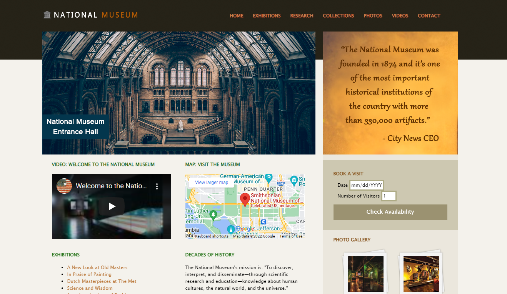

# National Museum Home Page

This project is the home page of a fictional museum named National Museum. No country was specified, but the video title is a real YouTube video from the Smithsonian National Museum of American History, the map also points to a that musuem, for illustrative purposes only. 
## Screenshot 

## Technology Stack

The project was built with:

+ HTML
+ CSS
